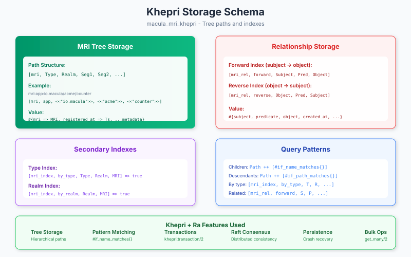

# Khepri Storage Adapter for MRI

This guide covers the Khepri-based storage implementation for Macula Resource Identifiers.

**For core MRI concepts, format, and type registry, see the [MRI Guide](https://github.com/macula-io/macula/blob/main/guides/mri.md) in the macula/ repository.**

## Overview



`macula_mri_khepri` implements the `macula_mri_store` and `macula_mri_graph` behaviours using [Khepri](https://github.com/rabbitmq/khepri), a tree-like replicated database built on [Ra](https://github.com/rabbitmq/ra) (Raft consensus).

### Why Khepri?

| Feature | Benefit for MRI |
|---------|-----------------|
| **Hierarchical paths** | Natural fit for MRI's path structure |
| **Raft consensus** | Distributed consistency across nodes |
| **Pattern matching** | Efficient prefix queries for children/descendants |
| **Transactions** | Atomic multi-key operations |
| **Persistence** | Crash recovery with snapshots |

## Installation

Add to your `rebar.config`:

```erlang
{deps, [
    {macula_mri_khepri, "0.1.0"}
]}.
```

## Configuration

```erlang
%% In sys.config or application env
{macula_mri_khepri, [
    %% Khepri store name
    {store_name, mri_store},

    %% Data directory for persistence
    {data_dir, "/var/lib/macula/mri"},

    %% Cluster name for distributed mode
    {cluster_name, macula_mri_cluster},

    %% Enable/disable indexes
    {enable_type_index, true},
    {enable_realm_index, true}
]}.
```

## Storage Schema

### MRI Tree

MRIs are stored in a hierarchical tree mirroring their path structure:

```erlang
%% Path: [mri, Type, Realm, Seg1, Seg2, ...]
%% Value: #{mri => MRI, registered_at => Timestamp, ...metadata}

%% Example: mri:app:io.macula/acme/counter
[mri, app, <<"io.macula">>, <<"acme">>, <<"counter">>]
%% => #{mri => <<"mri:app:io.macula/acme/counter">>,
%%      registered_at => 1705123456789,
%%      display_name => <<"Counter App">>}
```

### Relationship Indexes

Relationships are stored with bidirectional indexes for efficient traversal:

```erlang
%% Forward index: subject -> object
[mri_rel, forward, Subject, Predicate, Object]
%% => #{subject => S, predicate => P, object => O, created_at => Ts, ...metadata}

%% Reverse index: object -> subject
[mri_rel, reverse, Object, Predicate, Subject]
%% => #{subject => S, predicate => P, object => O, created_at => Ts, ...metadata}
```

### Secondary Indexes

For fast type and realm queries:

```erlang
%% Type index
[mri_index, by_type, Type, Realm, MRI] => true

%% Realm index
[mri_index, by_realm, Realm, MRI] => true
```

## API Usage

### Tree Operations

```erlang
%% Register an MRI with metadata
ok = macula_mri_khepri:register(
    <<"mri:app:io.macula/acme/counter">>,
    #{display_name => <<"Counter App">>}
).

%% Lookup
{ok, Metadata} = macula_mri_khepri:lookup(<<"mri:app:io.macula/acme/counter">>).

%% Update metadata
ok = macula_mri_khepri:update(
    <<"mri:app:io.macula/acme/counter">>,
    #{version => <<"1.2.0">>}
).

%% Delete
ok = macula_mri_khepri:delete(<<"mri:app:io.macula/acme/counter">>).

%% Check existence
true = macula_mri_khepri:exists(<<"mri:app:io.macula/acme/counter">>).
```

### Hierarchy Queries

```erlang
%% List direct children
Children = macula_mri_khepri:list_children(<<"mri:org:io.macula/acme">>).
%% => [<<"mri:user:io.macula/acme/alice">>,
%%     <<"mri:app:io.macula/acme/counter">>, ...]

%% List all descendants (recursive)
Descendants = macula_mri_khepri:list_descendants(<<"mri:org:io.macula/acme">>).
%% => [all users, apps, services, licenses under acme]

%% List by type within realm
Apps = macula_mri_khepri:list_by_type(app, <<"io.macula">>).
%% => [all apps in io.macula realm]
```

### Relationship Operations

```erlang
%% Create relationship
ok = macula_mri_khepri:relate(
    <<"mri:device:io.macula/citypower/cabinet-001">>,
    located_at,
    <<"mri:location:io.macula/citypower/nl/amsterdam">>
).

%% With metadata
ok = macula_mri_khepri:relate(
    <<"mri:app:io.macula/acme/frontend">>,
    depends_on,
    <<"mri:app:io.macula/acme/api">>,
    #{version => <<">=1.0.0">>, optional => false}
).

%% Custom relationship type
ok = macula_mri_khepri:relate(
    <<"mri:device:io.macula/acme/cabinet-001">>,
    {custom, <<"powered_by">>},
    <<"mri:device:io.macula/acme/transformer-007">>
).
```

### Relationship Queries

```erlang
%% Forward: what does X relate to?
ApiDeps = macula_mri_khepri:related_to(
    <<"mri:app:io.macula/acme/frontend">>,
    depends_on
).
%% => [<<"mri:app:io.macula/acme/api">>]

%% Reverse: what relates to X?
Dependents = macula_mri_khepri:related_from(
    <<"mri:app:io.macula/acme/api">>,
    depends_on
).
%% => [<<"mri:app:io.macula/acme/frontend">>]

%% All relationships from a subject
AllRels = macula_mri_khepri:all_related(
    <<"mri:device:io.macula/citypower/cabinet-001">>
).
%% => [{located_at, <<"mri:location:...">>}, {instance_of, <<"mri:class:...">>}]

%% Transitive traversal (all dependencies, recursively)
AllDeps = macula_mri_khepri:traverse_transitive(
    <<"mri:app:io.macula/acme/frontend">>,
    depends_on,
    forward
).
```

### Taxonomy Queries

```erlang
%% Direct instances of a class
Cabinets = macula_mri_khepri:instances_of(
    <<"mri:class:io.macula/street-cabinet">>
).

%% All instances including subclasses (transitive)
AllEdgeDevices = macula_mri_khepri:instances_of_transitive(
    <<"mri:class:io.macula/edge-device">>
).
%% => includes street-cabinets, sensors, gateways, etc.

%% Classes of an instance
Classes = macula_mri_khepri:classes_of(
    <<"mri:device:io.macula/citypower/cabinet-001">>
).
%% => [<<"mri:class:io.macula/street-cabinet">>]

%% Class hierarchy
Superclasses = macula_mri_khepri:superclasses(
    <<"mri:class:io.macula/street-cabinet">>
).
%% => [<<"mri:class:io.macula/edge-device">>]

Subclasses = macula_mri_khepri:subclasses(
    <<"mri:class:io.macula/device">>
).
%% => [<<"mri:class:io.macula/edge-device">>]
```

### Bulk Operations

```erlang
%% Import multiple MRIs
ok = macula_mri_khepri:import([
    {<<"mri:user:io.macula/acme/alice">>, #{role => admin}},
    {<<"mri:user:io.macula/acme/bob">>, #{role => developer}},
    {<<"mri:app:io.macula/acme/counter">>, #{}}
]).

%% Export all MRIs (for backup/migration)
{ok, AllMRIs} = macula_mri_khepri:export().
```

## Query Patterns (Khepri-specific)

Khepri's pattern matching enables efficient queries:

```erlang
%% Children query uses name matching
Path ++ [#if_name_matches{regex = any}]

%% Descendants query uses path matching
Path ++ [#if_path_matches{regex = any}]

%% Type index query
[mri_index, by_type, Type, Realm, #if_name_matches{regex = any}]

%% Relationship query
[mri_rel, forward, Subject, Predicate, #if_name_matches{regex = any}]
```

## Distributed Setup

### Cluster Formation

```erlang
%% Node 1
ok = macula_mri_khepri:start(#{
    store_name => mri_store,
    data_dir => "/var/lib/macula/mri"
}).

%% Node 2 joins Node 1
ok = macula_mri_khepri:join('node1@host1').

%% Check cluster members
{ok, Members} = macula_mri_khepri:members().
```

### Consistency Guarantees

- **Strong consistency**: All reads see the latest committed write
- **Raft quorum**: Writes require majority acknowledgment
- **Leader election**: Automatic failover if leader fails

## Performance Considerations

### Indexing Strategy

1. **Type index**: Enables O(1) lookup for `list_by_type/2`
2. **Realm index**: Enables O(1) lookup for realm-scoped queries
3. **Bidirectional relationships**: Enables O(1) both forward and reverse traversal

### Query Optimization

```erlang
%% GOOD: Use indexes
Apps = macula_mri_khepri:list_by_type(app, <<"io.macula">>).

%% AVOID: Full tree scan
%% (list_descendants on realm root)
All = macula_mri_khepri:list_descendants(<<"mri:realm:io.macula">>).
```

### Batch Operations

For bulk inserts, use `import/1` instead of individual `register/2` calls:

```erlang
%% GOOD: Single transaction
macula_mri_khepri:import(ListOfMRIs).

%% AVOID: Multiple transactions
lists:foreach(fun({MRI, Meta}) ->
    macula_mri_khepri:register(MRI, Meta)
end, ListOfMRIs).
```

## Troubleshooting

### Common Issues

| Issue | Cause | Solution |
|-------|-------|----------|
| `{error, not_found}` | MRI not registered | Check path spelling, register first |
| `{error, already_exists}` | Duplicate registration | Use `update/2` instead |
| `{error, timeout}` | Raft consensus timeout | Check cluster connectivity |
| `{error, no_quorum}` | Majority of nodes unavailable | Restore cluster health |

### Debugging

```erlang
%% Check store status
{ok, Status} = macula_mri_khepri:status().

%% List all MRIs (dev only)
{ok, All} = macula_mri_khepri:export().

%% Check relationship indexes
RelPath = [mri_rel, forward, Subject],
{ok, Rels} = khepri:get_many(mri_store, RelPath ++ [#if_name_matches{regex = any}]).
```

## Related Documentation

- [Core MRI Guide](https://github.com/macula-io/macula/blob/main/guides/mri.md) - Format, types, behaviours
- [Khepri Documentation](https://github.com/rabbitmq/khepri)
- [Ra (Raft) Documentation](https://github.com/rabbitmq/ra)
